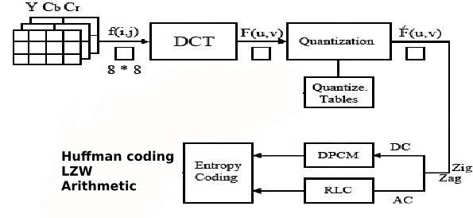
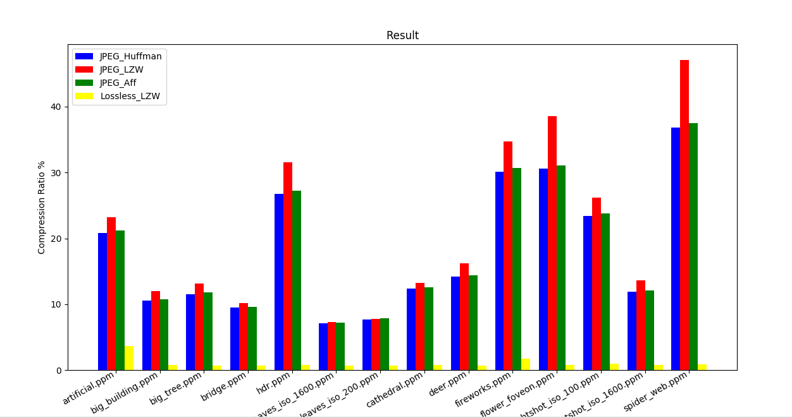
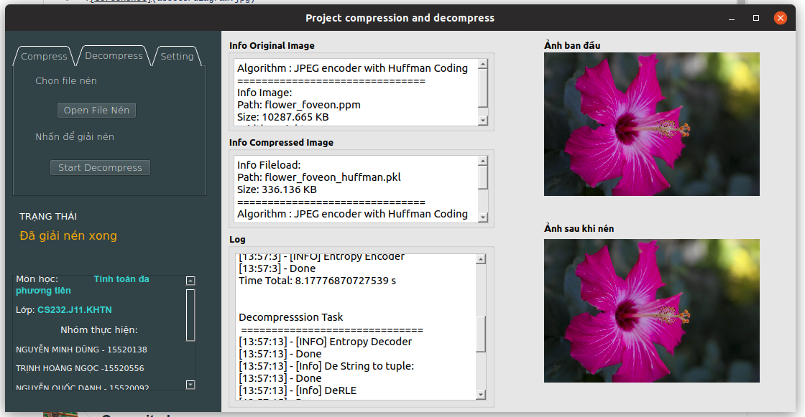

# CompressAndDecompress
JPEG-ENCODER / LWZ / HUFFMAN / RLE

# Report:


| File Report | [https://docs.google.com/document/d/1jyti02LK17ekOrQaQvhN2etLIkSyayXPVOyLIvbuGxE/edit] |
| ------ | ------ |
# Compression Algorithms:
- In this project, we provide JPEG-ENCODER (Lossy Compression Algorithms) combine with Lossless Compression Algorithms (Huffman, LZW, ARITHMETIC).
- This is Base Line of ENCODER (DECODER similar): 





# Install Enviroment:
Install the dependencies:
```sh
$ pip install -r requirements.txt
```
Or Use ENV:
```sh
$ source env/bin/activate
```

# Run Code: 

```sh
$ cd JPEG_ENCODER
$ python run.py [-h] -i INPUT [-f FLAG] [-m METHOD]
```
- -i INPUT: Path Image
- -f FlAG : Choose: 0 :Compress | 1 :Decompress (default : 0)
- -m METHOD: Choose method: 0 :JPEG encoder with Huffman Coding | 1 :JPEG encoder LZW Coding | 2 :JPEG encoder Arithmetic Coding | 3 :LZW Lossless Coding (default: 0)
- Note: File Result wil be saved in the same folder.
# Result with some raw images:



# DEMO:



Run:
```sh
$ python GUI.py
```
